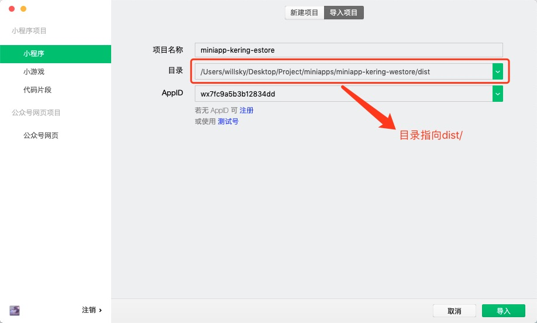

## #使用方法#

### 环境依赖
```bash
node v8.9.0-v10.17.0
npm v5.5.1-v6.11.3
```


### 安装依赖
```bash
[user$]: cnpm install
```


### 项目运行
```bash
# DEV环境
[user$]: npm run dev

# UAT环境
[user$]: npm run uat

# PROD环境
[user$]: npm run prod

#代码压缩混淆
[user$]: npm run dev|uat|prod --build
```


### 开发者工具
#### 微信开发者工具 -> 小程序 -> 新建项目 -> 导入项目

#### 微信开发者工具 -> 详情
- [x] ES6 转 ES5
- [x] 增强编译
- [ ] 使用npm模块
- [x] 自行运行体验评分
- [x] 不校验合法域名、web-view(业务域名)、TLS版本以及HTTS证书
- [x] 上传代码时样式自动补全
- [x] 上传代码时自动压缩混淆(Terser)
- [ ] 上传代码进行代码保护
- [x] 启动多核心编译
- [x] 自用自定义处理命令


### 新建页面
```bash
[user$]: npm run create
> miniapps-base@0.0.1 create /Users/willsky/Desktop/Project/miniapps/miniapp-kering-westore
> node generate/index.js
? Select a module type pages
? Input the page name test1 test2
? Do you need a configuration file (default true) Yes
? Select a style framework scss
? Select a Html framework jade
? Whether to enable preloading (default true) Yes
```

